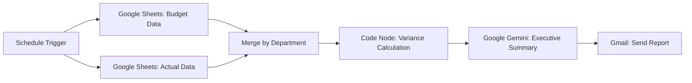

# 📊 AI-Powered Budget vs Actual Variance Analysis (n8n Automation)


An end-to-end **FP&A automation workflow** built in n8n that reads monthly Budget and Actual figures from Google Sheets, calculates department-level variances, generates an AI-written executive summary using Google Gemini, and emails a CFO-ready report automatically — no manual reporting required.

---

## 🎯 Problem Statement

Every month, Finance & FP&A teams manually:
- Pull budget and actual numbers from spreadsheets or ERP exports
- Calculate variance ($ and %) for each department or cost center
- Flag departments that are over/under budget
- Write commentary and recommendations for leadership

This is repetitive, time-consuming, and prone to manual error — a strong candidate for automation.

## ✅ What This Workflow Does

1. **Triggers on schedule** (e.g., 1st of every month)
2. **Reads Budget data** and **Actual data** from two separate Google Sheets tabs (in parallel)
3. **Merges** both datasets by matching the `Department` field
4. **Calculates** for each department:
   - Variance Amount (Actual − Budget)
   - Variance Percentage
   - Status (Over Budget / Under Budget)
5. **Sends the structured data to Google Gemini**, which generates a professional executive summary covering:
   - Overall budget vs actual performance
   - Departments exceeding budget and by how much
   - Commentary and actionable recommendations
6. **Emails the AI-generated report** to the finance team via Gmail — fully automated, on schedule

---

## 🏗️ Architecture



**Key design decision:** Budget and Actual Sheets nodes run **in parallel** from the trigger (not chained sequentially). Chaining them causes a cross-join bug where n8n re-reads the second sheet once per row of the first, multiplying a clean 4-row dataset into 16 duplicated items. Running them in parallel and merging by matching fields (`Department`) keeps the dataset clean.

---

## 🧩 Nodes Used

| Node | Purpose |
|---|---|
| Schedule Trigger | Runs the workflow monthly (or on a custom schedule) |
| Google Sheets ×2 | Reads Budget and Actual data independently |
| Merge (Merge By Matching Fields) | Combines Budget + Actual by `Department` |
| Code (JavaScript) | Calculates variance $, variance %, and status |
| Google Gemini | Generates the executive summary and recommendations |
| Gmail | Sends the final report to stakeholders |

---

## 📄 Sample Data

**Input — `sample-data/budget_actual_sample.csv`**

| Department | Budget | Actual |
|---|---|---|
| Marketing | 5000 | 6200 |
| HR | 3000 | 2800 |
| IT | 7000 | 8100 |
| Sales | 4000 | 3900 |

**Output — after Code node**

```json
[
  {
    "Department": "Marketing",
    "Budget": 5000,
    "Actual": 6200,
    "VarianceAmount": 1200,
    "VariancePercentage": "24.00%",
    "Status": "Over Budget",
    "IsOverBudget": true
  },
  {
    "Department": "HR",
    "Budget": 3000,
    "Actual": 2800,
    "VarianceAmount": -200,
    "VariancePercentage": "-6.67%",
    "Status": "Under Budget",
    "IsOverBudget": false
  }
]
```

**Sample AI-generated summary (excerpt)**

> Total actual expenditure for the period was $6,200 against a budgeted amount of $5,000 — an unfavorable variance of $1,200 (24%). Marketing is the primary driver of this overrun. Recommend a deep-dive audit of Marketing's itemized spend and a temporary pre-approval threshold for expenses exceeding $1,000 until the department realigns with fiscal targets.

---

## ⚙️ Setup Instructions

1. Create a Google Sheet with two tabs: `Budget` (`Department`, `Budget`) and `Actual` (`Department`, `Actual`)
2. Import the workflow JSON (`workflow.json`) into your n8n instance
3. Connect your **Google Sheets**, **Google Gemini**, and **Gmail** credentials
4. Update the Sheet ID/URL in both Google Sheets nodes
5. Set your recipient email in the Gmail node
6. Test each node individually, then activate the workflow

---

## 🧠 Key Technical Challenges Solved

- **Cross-join duplication bug**: Sequentially chained Google Sheets nodes caused a 4×4 → 16-item duplication. Fixed by running both nodes in parallel from the trigger and merging by matching fields.
- **Markdown-in-HTML rendering**: Gemini's Markdown-formatted output (`**bold**`, `###` headers) doesn't auto-render in Gmail's HTML mode. Resolved by either sending as plain text or converting the summary into proper HTML markup before sending.
- **Deduplication logic**: Added a `Map`-based dedup safeguard in the Code node to guarantee one clean record per department regardless of upstream data issues.

---

## 🔗 Part of a Finance Automation Portfolio

This is one of a series of AI-powered finance automation workflows built in n8n, including:
- Bank Reconciliation Automation
- Accounts Payable (AP) Invoice Processing
- **Budget vs Actual Variance Analysis** *(this repo)*

Built to demonstrate practical automation skills for **Finance Automation, FP&A, and Accounting Systems** roles.

---

## 👤 Author

**Syed Ali Raza** — Finance & Accounts professional (Treasury, Tax Compliance, FP&A) transitioning into Finance Automation.

- 💼 [LinkedIn](https://www.linkedin.com/in/syed-ali-raza1990/)
- 🧑‍💻 [Upwork](https://www.upwork.com/freelancers/syedaliraza73)
- 📧 [Alisherazi51215@Yahoo.Com](mailto:Alisherazi51215@Yahoo.Com)
